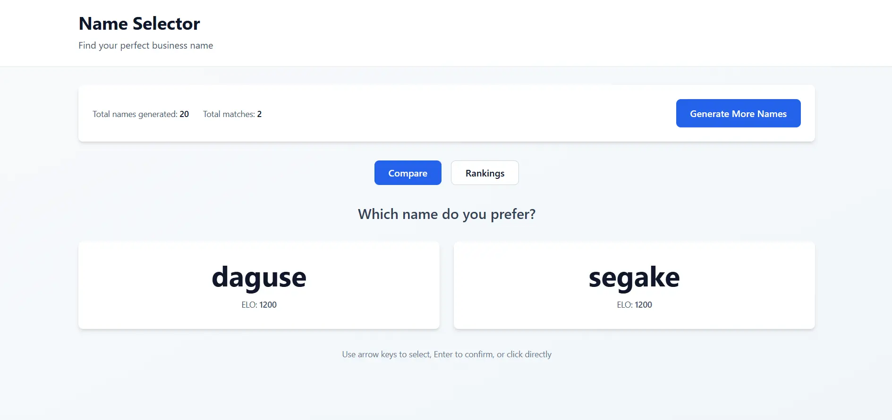

# Name Selector

A web application that generates unique business names using syllable combinations and uses ELO-style ranking to help you find a name you love.

## Overview

Name Selector generates phonetically diverse business names by combining consonants and vowels into 3-5 syllable words. You compare names side-by-side (two or more at a time), and the app ranks them using an ELO rating system to surface your top-rated names over time.

## Screenshots



## Features

- **Smart Name Generation**: Creates unique names by combining consonants and vowels
  - Configurable syllables (default: 3-5 per name)
  - Prevents duplicates with set-based tracking
  - Generate batches of names on demand
  
- **Interactive Comparison**: Click to compare and vote
  - Compare 2 or more names side-by-side
  - Click to select your preferred name
  - N-way comparisons supported (winner beats all losers simultaneously)
  - See results immediately reflected in rankings
  
- **ELO-based Ranking**: Names ranked by preference using ELO rating system
  - Ratings adjust after each comparison
  - Top-rated names surface naturally over time
  - Win rate calculation for each name
  
- **Live Statistics**: Track your engagement
  - Total names generated
  - Total matches (number of selections/clicks made)
  
- **Persistent Storage**: All data stored in browser localStorage
  - Generated names
  - ELO ratings
  - Comparison history
  
- **Ranking Table**: View all names with detailed stats
  - Rank and name
  - ELO rating
  - Win/loss record
  - Win rate percentage
  - Total matches (comparisons) for each name

## Tech Stack

- **Frontend Framework**: SvelteKit 2.61+ with Svelte 5.55+
- **Language**: TypeScript 5.6+ (strict mode, no JavaScript)
- **Styling**: Tailwind CSS 3.4
- **Build Tool**: Vite 5.0+
- **Storage**: Browser localStorage
- **UUID Generation**: uuid 9.0+
- **Data Format**: JSON

## Node.js & Dependencies

- **Node.js**: 18.19.1+ (tested with v18)
- **npm**: 9.2.0+
- Vite v5 is compatible with Node 18.19+
- All dependencies aligned with gocommerce project patterns

## Project Structure

```
name_selector/
├── README.md                          # This file
├── src/
│   ├── routes/
│   │   ├── +page.svelte              # Main comparison view
│   │   └── +layout.svelte            # Layout wrapper
│   ├── lib/
│   │   ├── services/
│   │   │   ├── nameGenerator.ts       # Class-based name generation (configurable)
│   │   │   ├── eloRanking.ts          # ELO rating calculations
│   │   │   └── storage.ts             # localStorage management
│   │   ├── components/
│   │   │   ├── ComparisonView.svelte  # Two-name comparison UI
│   │   │   ├── RankingTable.svelte    # Ranking display
│   │   │   └── Controls.svelte        # Generate button, settings
│   │   ├── stores/
│   │   │   └── appState.ts            # Svelte stores for state management
│   │   └── types/
│   │       └── index.ts               # TypeScript definitions
│   └── app.css                        # Global styles
├── package.json
├── svelte.config.js
├── vite.config.js
├── tailwind.config.js
└── postcss.config.js
```

## Core Algorithms

### Name Generation

**Architecture**: `NameGenerator` is a configurable class that generates phonetic names.

**Syllable Structure**: Each syllable is a consonant + vowel combination.

```
Consonants: b, c, d, f, g, h, j, k, l, m, n, p, r, s, t, v, w, x, y, z
Vowels: a, e, i, o, u

Name = [Syllable₁][Syllable₂][Syllable₃...] where 3 ≤ count ≤ 5
```

**Configuration** (via constructor):
```typescript
const generator = new NameGenerator({
  consonants: ['b', 'c', 'd', ...],     // Custom consonants (optional)
  vowels: ['a', 'e', 'i', ...],         // Custom vowels (optional)
  minSyllables: 3,                       // Minimum syllables per name (default: 3)
  maxSyllables: 5,                       // Maximum syllables per name (default: 5)
  initialEloRating: 1200                 // Starting ELO rating (default: 1200)
});

// Usage
const names = generator.generateNames(100, existingNamesSet);
const pair = generator.getRandomNames(names, 2);
```

**Uniqueness**: Generated names are tracked in a `Set<string>` to prevent duplicates.

**Smart Comparison Selection**: When selecting names for comparison, the app uses a biased sliding window approach so that top-ranked and under-compared names appear more often:
- Builds a window of nearby names (size = `min(5 × comparison count, names.length)`) from the ELO-sorted list.
- The window's starting index is drawn with a **bias toward 0** (low indices = high ELO), so windows near the top of the list are picked more often. This gives top-ranked names more opportunities to be compared and separated.
- Inside the window, candidates are sorted by `comparisons` ascending and indices are drawn with the **same bias toward 0**, so names that have been compared the fewest times are preferred.
- Result: Comparisons are between names with similar ELO ratings (meaningful choices, no mismatches between very strong and very weak names), while keeping the comparison load balanced across the pool.

### ELO Ranking

The ELO system adjusts ratings after each comparison based on:
- Current ratings of both names
- Who was favored
- Surprise factor (if upset occurs)

**Formula**:
```
Rating_new = Rating_old + K * (Actual - Expected)

Where:
- K = scaling factor (typically 32)
- Actual = 1 if name won, 0 if name lost
- Expected = 1 / (1 + 10^((opponent_rating - rating) / 400))
```

**Initial Rating**: 1200 ELO (arbitrary starting point)

**N-Way Comparisons**: When comparing more than 2 names:
- Winner's rating is updated against each loser independently
- All rating changes are calculated against baseline winner rating
- Total rating change = sum of changes from all individual matchups
- Winner gains 1 win and 1 comparison for each loser defeated

## Data Schema

### Generated Names (localStorage format)
```json
{
  "names": [
    {
      "id": "uuid-v4",
      "text": "ketalo",
      "eloRating": 1250,
      "wins": 5,
      "losses": 3,
      "comparisons": 8,
      "createdAt": "2026-07-01T12:00:00Z"
    }
  ],
  "generatedNameSet": ["ketalo", "midale", "porina"]
}
```

**Field Definitions:**
- `id`: Unique identifier (UUID v4)
- `text`: The generated name
- `eloRating`: Current ELO rating (higher = more preferred)
- `wins`: Number of times this name won in comparisons
- `losses`: Number of times this name lost in comparisons
- `comparisons`: Total number of times this name appeared in a comparison
- `createdAt`: ISO 8601 timestamp of when name was generated
- `generatedNameSet`: Array of all generated name strings (for deduplication)

## Development Roadmap

### Phase 1: MVP ✅ Complete
- [x] Initialize SvelteKit project with Svelte 5
- [x] Implement name generation service
- [x] Implement ELO ranking service
- [x] Implement localStorage persistence
- [x] Build comparison UI (click-based)
- [x] Build ranking table view
- [x] Build generation controls
- [x] N-way comparison support (2+ names)

### Phase 2: Input Methods
- [ ] Add keyboard navigation (arrow keys)
- [ ] Add touch/swipe support for mobile

### Phase 3: Polish
- [ ] Add name filtering/search
- [ ] Export generated names
- [ ] Settings (K-factor adjustment, reset data)
- [ ] Dark mode

## Development Guidelines

### TypeScript Requirements
- **All code must be TypeScript** — `.ts` and `.svelte` files only, no `.js` files
- Enable `strict: true` in `tsconfig.json`
- All functions must have explicit type annotations
- Use interfaces for data shapes
- No `any` types unless absolutely unavoidable
- Configure SvelteKit to enforce TypeScript

### Svelte 5 Best Practices
- Use `<script lang="ts">` in all `.svelte` files
- Use `$state()` rune for reactive state
- Use `$derived()` rune for derived values
- Use `$props()` rune with interface-based Props for component props
- Use `onclick` attribute instead of deprecated `on:click`
- Prefer Svelte stores for shared state
- Keep components focused and single-responsibility

### Architecture Patterns
- Use **classes** for services with stateful behavior and configuration (e.g., `NameGenerator`)
- Keep services **immutable-by-default**: return new instances rather than mutating state
- Use **TypeScript interfaces** for all configuration objects and type definitions
- Export **single instances** from module level when appropriate (e.g., `const nameGenerator = new NameGenerator()`)
- Use **private methods** for internal logic; expose only public methods

## Getting Started

```bash
# Install dependencies
npm install

# Start development server (http://localhost:5173)
npm run dev

# Build for production
npm run build

# Preview production build locally
npm run preview
```

### Development Server Features
- Hot module reloading (HMR)
- Access at `http://localhost:5173`
- TypeScript strict mode enabled
- Tailwind CSS preprocessed on-the-fly

## How to Use

1. **Start**: App auto-generates initial batch of unique names
2. **Compare**: Multiple names appear side-by-side; click the one you prefer as the winner
   - Two-way comparison: Choose your favorite of two names
   - N-way comparison: Choose your favorite from multiple names (all others count as losses)
3. **Track Progress**: See real-time statistics:
   - **Total names generated**: How many unique names created so far
   - **Total matches**: How many selections/clicks you've made
4. **View Rankings**: Switch to Rankings tab to see names sorted by ELO rating
5. **Generate More**: Hit "Generate More Names" to expand the pool
6. **Repeat**: Keep comparing to find your favorite names

The more you compare, the more accurate the rankings become. Popular names rise to the top!

## Statistics Explained

- **ELO Rating**: A number representing the name's "strength" based on wins/losses. Higher = more preferred.
- **Wins/Losses**: How many times this name won/lost in direct comparisons.
- **Win Rate**: Percentage of matches won (wins ÷ total matches).
- **Matches**: How many times this name appeared in a comparison.
- **Total Matches**: The sum of all your selections/clicks across all names.

## Notes

- All data is stored in browser localStorage; clearing browser data will reset the app
- ELO rating K-factor is fixed at 32 (configurable in Phase 3)
- Initial ELO rating is 1200 for all newly generated names
- Total matches = sum of all name comparisons ÷ 2 (since each match involves two names)
